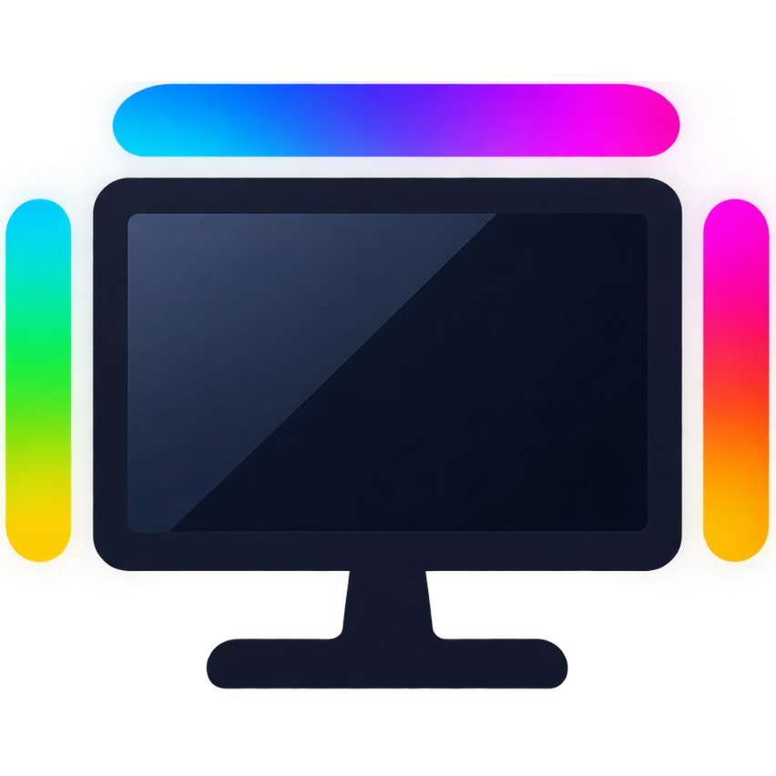

<div align="center">
  

  # LG UltraGear RGB Control

  **System-tray ambilight for LG UltraGear monitors — on Windows, without LG's software.**

  [](https://github.com/ruriba/lg-ultragear-rgb-control/actions/workflows/ci.yml)
  
  
  
</div>

A Windows system-tray application that drives the RGB backlight strip of
compatible LG UltraGear monitors over USB HID: the 48 LEDs behind the screen
mirror your desktop colors or react to system audio. One portable
executable — no installer, no services, no account.

## Features

- **Settings panel** — every control also lives in a modern window
  ("Open panel" in the tray menu, built with Slint's fluent style): live
  sliders (brightness, smoothing, boost, FPS, sensitivity — tuning applies
  on the next frame), mode and sampling radios, color swatches with the
  native picker, sync switches. Menu and panel mirror each other; closing
  the window hides it.
- **Image Sync** — captures the desktop through DXGI (HDR aware) and streams
  the colors of the screen edges (5% or 15% ring) or the whole screen to the
  48 LEDs. Block averaging runs on the GPU (D3D11 compute shader). Zero CPU
  cost on a still desktop: the capture blocks in the kernel until something
  changes.
- **Audio Sync** — the LEDs react to system volume through WASAPI loopback
  capture (no microphone), with rainbow/solid palettes, sensitivity and
  temporal envelope controls.
- **Static colors** in 4 slots with a native color picker, 12 brightness
  levels, and the monitor's built-in Peaceful/Dynamic modes.
- **Set and forget** — persistent settings, Windows autostart, 10-language
  UI, single instance, instant re-plug detection, and automatic recovery
  after monitor power events, sleep or display-topology changes.

## Supported monitors

27GN950 / 38GN950 (PID `0x9A8A`, usage page `0xFF01` or `0`) and 38GL950G
(PID `0x9A57`). Developed and tested on a 38GN950; the other models speak
the same protocol but are untested. A single compatible monitor is
controlled; simultaneous multi-monitor support is not available. If several
compatible monitors are attached, only the one on the primary display is
driven and the rest are ignored.

## Requirements

- Windows 10 or 11.
- Image Sync averages the sampled screen blocks on the GPU, so it needs a GPU
  with Direct3D 11 feature level 11_0 (any discrete or integrated GPU from
  ~2011 on, including Intel iGPUs, and it works over RDP sessions). Without
  it, Image Sync is unavailable (the tray status shows the reason); static
  colors and Audio Sync work on any machine.

## Installation

**Download** the prebuilt `lg-ultragear-rgb-control.exe` from the
[Releases](../../releases) page and run it — a tray icon appears, that's the
whole app. `settings.json` (settings) and `lg-ultragear-rgb-control.log`
(panics) are created next to the executable, or in
`%APPDATA%\lg-ultragear-rgb-control\` when that directory is not writable
(e.g. an install under Program Files).

**Build from source** with a stable Rust toolchain (MSVC target):

```text
cargo build --release
target\release\lg-ultragear-rgb-control.exe
```

The compute shader is compiled to DXBC at build time via `d3dcompiler_47`
(present on any Windows 10/11 machine); the shipped executable never needs
it.

## Usage

Right-click the tray icon for the menu. Every change applies immediately and
survives a restart. With the monitor absent (unplugged, standby, input
switch), changes are still remembered and applied the moment it reconnects.
This is the condensed reference — the
[full manual](docs/usage.md) covers power-event behavior and edge cases.

### General controls

- **Turn LEDs on / Turn LEDs off** — powers the strip. Turning them off
  stops a running sync but remembers it: the next **Turn LEDs on** resumes
  the same source.
- **Brightness ▸ Level 1–12** — on static modes it sets the backlight level;
  while a sync runs it dims the LEDs in software without stopping the sync.
- **Modes ▸ Static 1–4 / Peaceful / Dynamic** — the monitor's built-in
  modes. Selecting any of them stops a running sync.
- **Color ▸ Slot 1–4** — opens the native color picker, stores the color in
  that slot and switches the monitor to it.
- **Source screen** — Image Sync always samples the UltraGear display
  carrying the RGB strip, detected automatically from its EDID model (no
  picker, like LG's own software).

### Image Sync

Mirrors what is on screen (video-sync mode; a still image is kept alive with
a 5 s keepalive so the monitor stays armed).

| Option | Values | Effect |
|---|---|---|
| Sampling | Border 5% / Border 15% / Full screen | Where the LEDs look: a ring just inside the bezel, deeper in, or the whole screen |
| Smoothing | Instant / Low / Normal / High | Temporal blend between frames; higher fades more, Instant can flicker |
| Boost | 1.0×–2.0× | Multiplier over the averaged colors; high values oversaturate |
| FPS | 10 / 15 / 30 / 60 | LED update cap; higher is snappier, more CPU and USB traffic |

### Audio Sync

The LEDs pulse with the loudness of whatever Windows is playing (loopback
capture of the default output device).

| Option | Values | Effect |
|---|---|---|
| Sensitivity | Low / Medium / High | Multiplier over the measured loudness |
| Color | Rainbow / Solid | Hue sweep across the strip, or one picked color |
| Blink | Smooth / Normal / Fast | Attack and fade of the envelope per beat |
| Dynamic Range | Compressed / Normal / Expanded / Extreme | Loudness → brightness curve, from lifted quiet content to beat strobing |

### App

- **Autostart** — launches the app on login (per-user registry `Run` entry).
- **Language** — follows the system UI language by default; a fixed choice
  switches the panel and tray menu immediately and persists.
- **Status line** — shows the connection state and the last diagnostic.
- **Quit** — stops any sync, leaves the monitor on the static mode you
  selected (Static 1 if none) and exits; the next launch resumes exactly
  where you left off, including a running sync.

## How it works

- The RGB-strip monitor is found by matching its EDID model through
  `QueryDisplayConfig` — the same trick LG's software uses, since Windows
  offers no HID-to-display correlation. Detection is strict: image sync only
  ever samples the UltraGear itself.
- A DXGI desktop duplication feeds each frame to a compute shader that
  averages 48 sample blocks on the GPU; identical frames are deduplicated
  and the last colors are resent every 5 s to keep the monitor in sync mode.
- USB traffic is split in two planes: commands travel a reliable ordered
  channel that the worker always services before any sync frame — so a
  manual action never queues behind frames, and a stopped sync's stale
  frames (dropped by session tokens) can never overwrite a manual command —
  while frames travel a latest-wins slot: only the newest colors are ever
  written, intermediate frames are coalesced away.
- Hardware overlay planes (MPO) can freeze the duplicated image while the
  desktop moves on; a staleness watchdog recreates the duplication when that
  is detected.
- Monitor re-plugs are detected through Windows device notifications, so the
  strip recovers the moment the USB link returns; periodic reconnection
  polling remains only as a fallback.
- The monitor's lighting controller resets to its factory state on any power
  event (firmware behavior). The app re-asserts the saved lighting state on
  USB reconnection, topology change, Windows resume — plus one delayed
  second pass for a controller that was still booting.

Frame layouts, commands and firmware quirks are collected in
[docs/protocol.md](docs/protocol.md).

## Acknowledgments

The monitor's HID protocol was not documented by LG; it was reverse
engineered by the authors of these upstream projects:

- [ryanw/lg-ultragear](https://github.com/ryanw/lg-ultragear) — Rust library
  with the reverse-engineered protocol,
- [subraizada3/27gn950controller](https://github.com/subraizada3/27gn950controller)
  — Python controller for the same monitors,

from which
[Bairminer/LG-Ultragear-RGB-Control](https://github.com/Bairminer/LG-Ultragear-RGB-Control)
(a Python utility, this project's immediate reference) was derived. This
project reimplements the protocol in Rust with no Python dependency and adds
DXGI capture, Audio Sync and persistence.

## Built with AI

This project was built mostly with AI: the large majority of the Rust code
was generated by an AI coding assistant in an interactive session, under
human direction. Architecture decisions, protocol measurements,
firmware-quirk characterization and hardware validation were done by a human
on a real 38GN950 — every timing constant in the code was measured on
hardware, not guessed.

## Disclaimer

This project is not affiliated with, endorsed by, or connected to LG
Electronics in any way. Use at your own risk.

## License

[GPL-3.0](LICENSE). Own code was MIT until v1.4; the
UI toolkit ([Slint](https://slint.dev)) is GPL-3.0 OR Royalty-Free OR
commercial, and GPL-3.0 was chosen for the project. The USB protocol
notes in `docs/protocol.md` are factual documentation, free to reuse.
