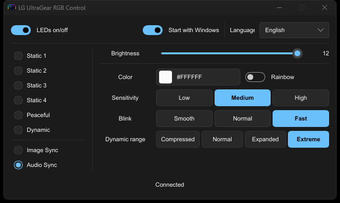
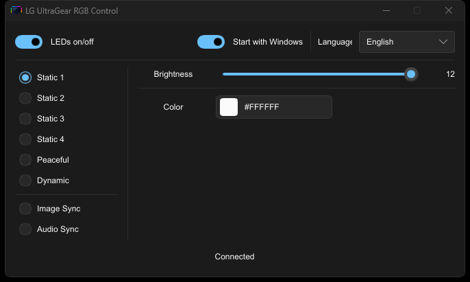
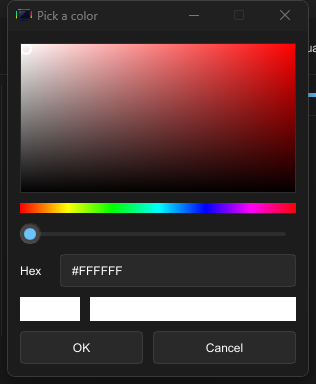
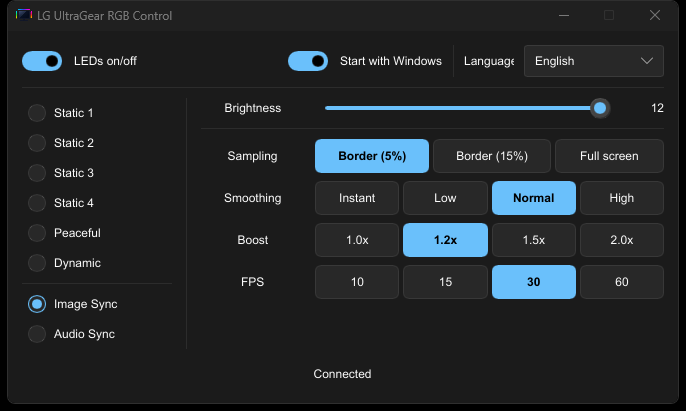

# Usage manual

A left click on the tray icon opens the settings panel; right-click it to
open the menu. Every change is applied
immediately and persisted to `settings.json` (rapid slider changes coalesce
into one write shortly after the drag ends); options marked **[restart]**
restart the sync engine (~1 s pause in the LEDs) because they need new
capture geometry.

The same controls also live in a settings window — **Open panel**, the first
menu item. It is a second view of the same state, in a fixed-size window
(it cannot be resized or maximized): one column picks what the strip does
(Static 1–4, Peaceful, Dynamic, Image Sync, Audio Sync) — picking the option
already active is a no-op. The right column always shows brightness, and
below it a section that follows the active mode: a static mode offers just
its own color, Image Sync its sampling, smoothing, boost and FPS, Audio
Sync its sensitivity, color, blink and dynamic range, and the modes without
settings of their own say so.

Static modes and Audio Sync share the same color control — a card showing
the current color or the rainbow sweep (with its hex or name), opening the
built-in dark color picker on click — and Audio Sync adds a **Rainbow**
switch that turns the sweep off again, restoring the last solid color
picked; its color row comes first.

The color picker opens in the same dark style: a hue square, a hue slider
and a hex field.

Every row follows the same label + control pattern: brightness keeps its
slider (twelve steps, applied as you drag), every other tuning uses
segmented pills with the same preset options as the menu (smoothing
Instant–High, boost 1.0×–2.0×, FPS 10–60, sensitivity Low–High), where all
options stay visible and one click switches. Tuning changes reach the LEDs
on the next frame, no engine restart (only a sampling pick restarts the
capture).

The panel always opens centered on your cursor's monitor, and hovering any
row's label shows what that setting does in the status bar at the bottom —
the manual, built into the window. The header holds the **LEDs on/off**
switch (strip power; same control as the menu's on/off entries) on the
left and, on the right, the **Start with Windows** switch and the language
selector; the status bar at the bottom shows the connection state (plus
any diagnostic). Closing the window destroys it and hands its memory back
to the system — the next open builds a fresh one showing the current state
— and the menu keeps working unchanged. Both surfaces mirror each other,
so a change made from the menu repaints the open panel and vice versa.

With the monitor absent (unplugged, standby, input switch), commands cannot
reach it, but nothing is lost: the app remembers what you set — modes,
colors, brightness, sync toggles — and reapplies it automatically when the
connection returns. A sync started while the monitor is absent simply waits
and arms itself on reconnection. The status line at the bottom of the menu
(and the top of the panel) shows the connection state at all times.

## General controls

- **Turn LEDs on / Turn LEDs off** — powers the monitor's backlight strip
  (the panel's **LEDs on/off** switch is the same control). Turning them
  off does not change the active mode: the panel stays where it is and
  every adjustment can still be made — the strip stays dark and each pick
  is remembered. The next **Turn LEDs on** lights the strip with that
  active configuration: a sync that was running restarts, and a sync
  chosen while the LEDs were off starts then.
- **Brightness ▸ Level 1–12** — LED brightness. On the static modes it sets
  the monitor's backlight level. While a sync runs it dims the LEDs in
  software (the monitor stays at max) and applies within a fraction of a
  second, without stopping the sync.
- **Modes ▸ Static 1–4 / Peaceful / Dynamic** — the monitor's built-in
  modes. Static 1–4 show the color stored in each slot (set it under
  **Color**); Peaceful and Dynamic are LG's own animations. Selecting any of
  these stops a running sync.
- **Color ▸ Slot 1–4** — opens the native Windows color picker, stores the
  color in that slot and switches the monitor to it so you can see it. The
  swatch icon always shows the slot's current color.
- **Source screen** — Image Sync always samples the UltraGear display that
  carries the RGB strip, detected automatically from its EDID model, like
  LG's own software (there is no picker). With several compatible monitors
  attached the primary one wins. While that monitor's desktop is absent
  (standby, input switch) image sync has no source: it idles and resumes by
  itself when the monitor comes back, re-arming the sync mode.

## Image Sync

Mirrors what is on screen. Toggling it on powers the LEDs, sets brightness to
12 and arms the monitor in video-sync mode. With a still screen the last
colors are resent every 5 s (keepalive) so the monitor stays in sync mode.

- **Sampling ▸ Border 5% / Border 15% / Full screen** — where the LEDs look.
  Border modes sample a ring just inside the bezel (5%) or deeper in (15%):
  classic bias lighting that reacts to content near the edges. Full screen
  gives every LED a strip of its half of the screen, so content anywhere maps
  to the ring. **[restart]**
- **Smoothing ▸ Instant / Low / Normal / High** — temporal blend between
  frames. Instant reacts raw (can flicker); higher values fade colors over
  several frames (0.4 Normal is the default).
- **Boost ▸ 1.0×–2.0×** — multiplier over the averaged colors, clamped at
  full white. Brightens dim content; high values oversaturate.
- **FPS ▸ 10 / 15 / 30 / 60** — LED update cap. Higher is snappier but costs
  more CPU and USB traffic. 30 is the default and visually smooth.

## Audio Sync

The LEDs pulse with the loudness of whatever Windows is playing (loopback
capture of the default output device — no microphone). The strip shows a
base palette whose brightness follows the measured volume envelope. Every
option applies immediately while Audio Sync runs — no restart, no LED gap.

- **Sensitivity ▸ Low / Medium / High** — multiplier over the measured
  loudness (0.5 / 1.0 / 2.0) before the response curve.
- **Color ▸ Rainbow / Solid** — Rainbow sweeps hues across the strip; Solid
  paints every LED with one color chosen in the native picker.
- **Blink ▸ Smooth / Normal / Fast** — temporal envelope: how fast the level
  climbs on a beat and how long it fades. Smooth = gentle climbs, slow
  fades; Normal = fast attack, moderate fade; Fast = punchy strobing.
- **Dynamic Range ▸ Compressed / Normal / Expanded / Extreme** — loudness →
  brightness curve. Compressed lifts quiet content so it is visible; Normal
  balances; Expanded keeps only the peaks; Extreme strobes on beats.

If the default output device changes or disappears, the capture reopens
automatically after a few seconds; if it cannot, the toggle unchecks itself
and the status line explains why.

## Autostart

Toggles a registry entry so the app launches on login:

- Key: `HKEY_CURRENT_USER\Software\Microsoft\Windows\CurrentVersion\Run`
- Value name: `lg-ultragear-rgb-control`
- Type: `REG_SZ`
- Data: full path of the running executable (e.g.
  `D:\apps\lg-ultragear-rgb-control\lg-ultragear-rgb-control.exe`)

Removing the entry disables autostart; it only affects the current Windows
user.

## Language ▸ System / English / Español / …

The menu language — also selectable from the panel's header combo box.
**System** follows the Windows UI language; picking a language switches the
panel, the tray menu and the tooltip immediately (and sticks across
launches).

## Status line

The disabled line near the bottom shows the monitor connection state and the
last engine diagnostic (e.g. audio capture unavailable). The tooltip shows
the same connection state.

## Power events (monitor off/on, power cut, sleep)

The monitor's lighting controller does not remember the active mode across a
power event: whenever it loses power it comes back in LG's factory state
(Static 4) — this is firmware behavior, not something the app sends.
The app re-asserts the saved lighting state on top of it:

- when the monitor's USB link reconnects (unplug, monitor off with the strip
  controller reset),
- when the monitor's output reappears on the desktop after it was gone
  (monitor standby, input switch),
- when Windows resumes from sleep,
- and one delayed second pass ~1 s after each of the above, in case the
  lighting controller was still booting when the first burst landed.

The delayed pass always applies the state current at that moment, so changes
made in between win. An Image Sync that was running when the PC lost power is
restarted as soon as the monitor's output is back on the desktop (at app
start the display topology may not be ready yet).

## Quit

Stops any running sync, leaves the monitor on the last static mode you
explicitly selected (Static 1 when none was set) and exits. Settings were
already saved after every change, so the next launch resumes exactly where
you left off (including a running sync).
